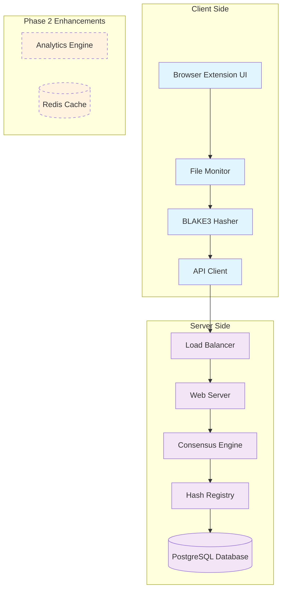
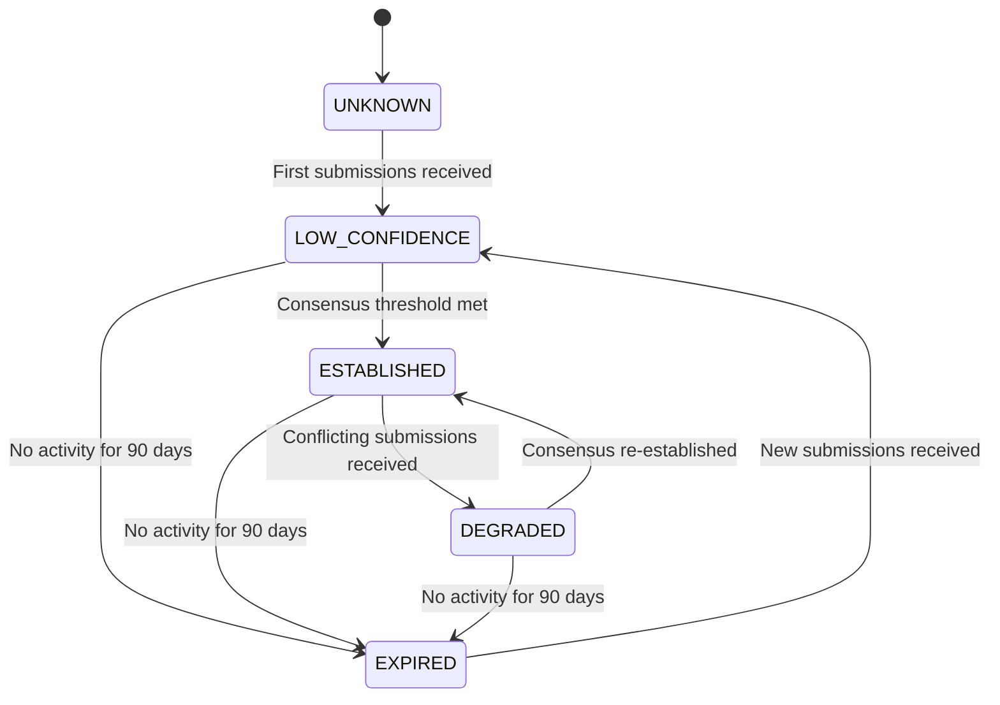

# Design Document: Crowdsourced Hash-Based Software Integrity Verification System

## Overview

The Crowdsourced Hash-Based Software Integrity Verification System is a distributed security framework that detects tampered software binaries through cryptographic hashing and consensus mechanisms. The system consists of a browser extension that computes BLAKE3 hashes of user-selected files and a Spring Boot backend that maintains a crowdsourced hash registry for integrity verification.

This system focuses specifically on **statistical integrity verification** rather than comprehensive security solutions. It is not an antivirus system, malware analyzer, blockchain implementation, or fully decentralized network. Instead, it provides a targeted framework for detecting supply chain attacks through crowdsourced hash consensus.

### Core Principles

- **User-Initiated Verification**: Manual file selection avoids browser permission complexity while maintaining security
- **Cryptographic Integrity**: BLAKE3 hashing provides fast, secure file fingerprinting
- **Crowdsourced Consensus**: Multiple independent submissions establish trusted hash baselines
- **Privacy Protection**: No personally identifiable information is collected or transmitted
- **Tamper Detection**: Deviation from consensus indicates potential supply chain attacks

### System Goals

1. **Security**: Detect tampered software binaries with high accuracy
2. **Privacy**: Protect user download patterns and personal information
3. **Performance**: Provide sub-second verification for files up to several GB
4. **Scalability**: Support millions of hash submissions and thousands of concurrent users
5. **Usability**: Deliver clear, actionable security feedback to non-technical users

### MVP Scope (Phase 1)

The initial implementation focuses on core integrity verification functionality:

**Included in MVP:**
- Browser extension with file selection and BLAKE3 hashing
- Spring Boot backend with PostgreSQL database
- Basic consensus calculation and lifecycle management
- Replay protection using IP + UserAgent + TimeWindow hashing
- REST API for hash submission and verification
- Simple administrative interface

**Technology Stack (MVP):**
- **Frontend**: Browser Extension (JavaScript/TypeScript)
- **Backend**: Spring Boot (Java)
- **Database**: PostgreSQL
- **Hashing**: BLAKE3
- **Communication**: REST API over HTTPS

**Phase 2 Enhancements:**
- Redis caching layer for improved performance
- Analytics Engine for tamper detection reporting
- Advanced replay protection mechanisms
- Comprehensive administrative dashboard
- Enhanced monitoring and alerting

## Architecture

### High-Level Architecture

The system follows a client-server architecture with clear separation between the browser extension (client) and backend services (server):



### Component Architecture

#### Browser Extension Components

1. **User Interface Layer**
   - File selection dialog
   - Verification status display
   - Configuration settings
   - Notification system

2. **File Processing Layer**
   - File type detection
   - Metadata extraction
   - BLAKE3 hash computation
   - Streaming file reader

3. **Communication Layer**
   - API client for backend communication
   - Request queuing and retry logic
   - Rate limiting compliance
   - Error handling

#### Backend Server Components

1. **API Gateway Layer**
   - Request routing and validation
   - Rate limiting and throttling
   - Authentication for admin endpoints
   - CORS and security headers

2. **Business Logic Layer**
   - Consensus calculation engine
   - Hash validation and formatting
   - Software identity resolution
   - Tamper detection logic

3. **Data Access Layer**
   - Hash registry management
   - Submission storage and retrieval
   - Analytics data aggregation
   - Cache management

## Components and Interfaces

### Consensus Lifecycle Management

The system implements an explicit consensus lifecycle that tracks how consensus evolves over time for each software identity:

#### Lifecycle States

1. **UNKNOWN**: No submissions have been received for this software identity
2. **LOW_CONFIDENCE**: Fewer than 3 submissions or less than 70% agreement among submissions
3. **ESTABLISHED**: 3 or more submissions with 70% or greater agreement on a single hash
4. **DEGRADED**: Previously established consensus now has conflicting submissions that reduce confidence
5. **EXPIRED**: No submissions received within the retention period (90 days)

#### State Transitions



#### Lifecycle Impact on Verification

- **UNKNOWN/LOW_CONFIDENCE**: Return "UNKNOWN" status with low confidence
- **ESTABLISHED**: Return "VERIFIED" or "TAMPERED" based on hash match
- **DEGRADED**: Return "SUSPICIOUS_LOW_CONFIDENCE" with warning
- **EXPIRED**: Treat as UNKNOWN until new submissions arrive

### Replay Protection Strategy (MVP)

Since the system has no user accounts, authentication, or persistent client identity, replay protection uses a temporary approach:

#### Implementation
- Generate replay protection hash: `SHA-256(IP_Address + User_Agent + Time_Window)`
- Time window: 24-hour periods (e.g., "2024-01-15-00" for all submissions on Jan 15)
- Store replay protection hash with each submission
- Reject duplicate submissions with same replay protection hash and software identity

#### Limitations
- Same user can submit once per 24-hour window per software identity
- Different browsers/devices from same IP can submit independently
- VPN/proxy users may share replay protection hashes (acceptable for MVP)
- Not cryptographically secure but sufficient for basic spam prevention

#### Future Enhancement
Phase 2 may implement more sophisticated replay protection with optional user accounts or browser fingerprinting.

### Browser Extension

#### File Selection Interface
```typescript
interface FileSelectionService {
  selectFile(): Promise<File | null>
  validateFileType(file: File): FileValidationResult
  extractMetadata(file: File): FileMetadata
}

interface FileValidationResult {
  isExecutable: boolean
  fileType: string
  warnings: string[]
}

interface FileMetadata {
  filename: string
  size: number
  lastModified: Date
  sourceDomain?: string
}
```

#### BLAKE3 Hasher Interface
```typescript
interface BLAKE3Hasher {
  computeHash(file: File): Promise<HashResult>
  computeHashStreaming(file: File, onProgress?: (progress: number) => void): Promise<HashResult>
}

interface HashResult {
  hash: string
  success: boolean
  error?: string
  processingTime: number
}
```

#### API Client Interface
```typescript
interface VerificationAPIClient {
  submitHash(submission: HashSubmission): Promise<SubmissionResult>
  verifyHash(request: VerificationRequest): Promise<VerificationResult>
  getStatus(): Promise<ServiceStatus>
}

interface HashSubmission {
  softwareIdentity: SoftwareIdentity
  hash: string
  timestamp: Date
  clientVersion: string
}

interface VerificationRequest {
  softwareIdentity: SoftwareIdentity
  hash: string
}
```

### Backend Server

#### Verification Controller Interface
```java
@RestController
@RequestMapping("/api/v1")
public class VerifyController {
    SubmissionResult submitHash(@RequestBody HashSubmission submission);
    VerificationResult verifyHash(@RequestBody VerificationRequest request);
    ServiceStatus getStatus();
}
```

#### Verification Service Interface
```java
public interface VerificationService {
    SubmissionResult storeSubmission(HashSubmission submission);
    VerificationResult verifyHash(VerificationRequest request);
    TamperStatus determineTamperStatus(String hash, ConsensusResult consensus);
    SuspicionLevel calculateSuspicionLevel(ConsensusResult consensus);
}

public enum TamperStatus {
    VERIFIED,
    TAMPERED, 
    SUSPICIOUS_LOW_CONFIDENCE,
    UNKNOWN,
    SERVICE_UNAVAILABLE
}
```

#### Submission Repository Interface
```java
public interface SubmissionRepository {
    void save(HashSubmission submission);
    List<HashSubmission> findByIdentityHash(String identityHash);
    void deleteExpiredSubmissions(Date cutoffDate);
    long countByIdentityHash(String identityHash);
}
```

#### Consensus Service Interface
```java
public interface ConsensusService {
    ConsensusResult calculateConsensus(String identityHash);
    boolean isReplayAttack(HashSubmission submission);
    double calculateConfidence(List<HashSubmission> submissions, String consensusHash);
    ConsensusLifecycle determineLifecycleState(ConsensusResult consensus);
}

public enum ConsensusLifecycle {
    UNKNOWN,           // No submissions yet
    LOW_CONFIDENCE,    // < 3 submissions or < 70% agreement
    ESTABLISHED,       // >= 3 submissions with >= 70% agreement
    DEGRADED,          // Conflicting submissions received
    EXPIRED            // No recent submissions (> 90 days)
}
```

### API Specifications

#### REST API Endpoints

**POST /api/v1/submissions**
```json
{
  "softwareIdentity": {
    "sourceDomain": "download.microsoft.com",
    "normalizedFilename": "setup.exe",
    "size": 1048576
  },
  "hash": "a1b2c3d4e5f6...",
  "timestamp": "2024-01-15T10:30:00Z",
  "clientVersion": "1.0.0"
}
```

**POST /api/v1/verify**
```json
{
  "softwareIdentity": {
    "sourceDomain": "download.microsoft.com",
    "normalizedFilename": "setup.exe",
    "size": 1048576
  },
  "hash": "a1b2c3d4e5f6..."
}
```

**Response Format**
```json
{
  "status": "VERIFIED",
  "confidence": 0.95,
  "submissionCount": 47,
  "consensusHash": "a1b2c3d4e5f6...",
  "message": "File verified against consensus",
  "timestamp": "2024-01-15T10:30:15Z"
}
```

## Data Models

### Core Data Structures

#### Software Identity
```typescript
interface SoftwareIdentity {
  sourceDomain: string        // Domain where file was downloaded from
  normalizedFilename: string  // Normalized filename (lowercase, extension preserved)
  size: number               // File size in bytes
  
  // Computed fields
  identityHash: string      // Hash of sourceDomain+normalizedFilename+size
}
```

#### Hash Submission
```typescript
interface HashSubmission {
  id: string
  softwareIdentity: SoftwareIdentity
  hash: string                    // BLAKE3 hash (64 hex chars)
  timestamp: Date
  clientVersion: string
  
  // Metadata for replay protection (MVP approach)
  replayProtectionHash: string    // Hash of (IP + UserAgent + TimeWindow)
  userAgent?: string             // For analytics
}
```

#### Consensus Result
```typescript
interface ConsensusResult {
  softwareIdentity: SoftwareIdentity
  consensusHash?: string
  confidence: number            // 0.0 to 1.0
  submissionCount: number
  status: ConsensusStatus
  lifecycle: ConsensusLifecycle
  lastUpdated: Date
  
  // Distribution data
  hashDistribution: Map<string, number>
  oldestSubmission: Date
  newestSubmission: Date
}

enum ConsensusStatus {
  ESTABLISHED = "ESTABLISHED",
  INSUFFICIENT_DATA = "INSUFFICIENT_DATA", 
  NO_CONSENSUS = "NO_CONSENSUS",
  EXPIRED = "EXPIRED"
}

enum ConsensusLifecycle {
  UNKNOWN = "UNKNOWN",           // No submissions yet
  LOW_CONFIDENCE = "LOW_CONFIDENCE",    // < 3 submissions or < 70% agreement
  ESTABLISHED = "ESTABLISHED",   // >= 3 submissions with >= 70% agreement
  DEGRADED = "DEGRADED",         // Conflicting submissions received
  EXPIRED = "EXPIRED"            // No recent submissions (> 90 days)
}
```

#### Verification Result
```typescript
interface VerificationResult {
  status: TamperStatus
  confidence: number
  submissionCount: number
  consensusHash?: string
  message: string
  timestamp: Date
  
  // Additional context
  suspicionLevel: SuspicionLevel
  recommendedAction: string
}

enum SuspicionLevel {
  NONE = 0,
  LOW = 1,
  MEDIUM = 2, 
  HIGH = 3,
  CRITICAL = 4
}
```

### Database Schema

#### Hash Submissions Table
```sql
CREATE TABLE hash_submissions (
    id UUID PRIMARY KEY,
    software_identity_hash VARCHAR(64) NOT NULL,
    source_domain VARCHAR(255) NOT NULL,
    normalized_filename VARCHAR(255) NOT NULL,
    file_size BIGINT NOT NULL,
    hash VARCHAR(64) NOT NULL,
    timestamp TIMESTAMP NOT NULL,
    client_version VARCHAR(32),
    replay_protection_hash VARCHAR(64) NOT NULL,
    user_agent TEXT,
    
    INDEX idx_software_identity (software_identity_hash),
    INDEX idx_hash (hash),
    INDEX idx_timestamp (timestamp),
    INDEX idx_replay_protection (replay_protection_hash, software_identity_hash, timestamp)
);
```

#### Consensus Cache Table
```sql
CREATE TABLE consensus_cache (
    software_identity_hash VARCHAR(64) PRIMARY KEY,
    consensus_hash VARCHAR(64),
    confidence DECIMAL(5,4),
    submission_count INTEGER,
    status VARCHAR(32),
    lifecycle VARCHAR(32),
    last_updated TIMESTAMP,
    expires_at TIMESTAMP,
    
    INDEX idx_expires (expires_at),
    INDEX idx_lifecycle (lifecycle)
);
```

#### Analytics Table (Phase 2 Enhancement)
```sql
-- This table will be implemented in Phase 2
CREATE TABLE tamper_analytics (
    id UUID PRIMARY KEY,
    date DATE NOT NULL,
    source_domain VARCHAR(255),
    file_extension VARCHAR(16),
    total_submissions INTEGER,
    tampered_submissions INTEGER,
    tamper_rate DECIMAL(5,4),
    
    UNIQUE KEY unique_daily_stats (date, source_domain, file_extension)
);
```

### Configuration Models

#### System Configuration
```yaml
# MVP Configuration (Phase 1)
consensus:
  threshold_percentage: 0.70
  minimum_submissions: 3
  confidence_high_threshold: 0.80
  confidence_minimum_submissions: 10

retention:
  submission_ttl_days: 90
  consensus_cache_ttl_hours: 24

performance:
  max_concurrent_requests: 1000
  api_timeout_seconds: 30
  hash_computation_timeout_seconds: 60

rate_limiting:
  submissions_per_ip_per_hour: 100
  verifications_per_ip_per_minute: 60
  admin_api_requests_per_minute: 1000

security:
  require_https: true
  cors_allowed_origins: ["chrome-extension://*"]
  admin_api_key_length: 32

# Replay Protection (MVP Approach)
replay_protection:
  time_window_hours: 24
  hash_algorithm: "SHA-256"  # For hashing IP + UserAgent + TimeWindow

# Phase 2 Enhancements (Future Implementation)
phase2:
  redis_cache:
    enabled: false  # Will be enabled in Phase 2
    cache_size_mb: 512
  analytics:
    enabled: false  # Will be enabled in Phase 2
    retention_days: 365
```
## Correctness Properties

*A property is a characteristic or behavior that should hold true across all valid executions of a system-essentially, a formal statement about what the system should do. Properties serve as the bridge between human-readable specifications and machine-verifiable correctness guarantees.*

### Property 1: File Type Classification

*For any* file with a supported executable extension (.exe, .msi, .dmg, .deb, .rpm, .appimage), the Browser_Extension should correctly identify it as an executable file type.

**Validates: Requirements 1.3**

### Property 2: File Metadata Extraction

*For any* selected file, the Browser_Extension should extract complete metadata including filename, size, and selection timestamp.

**Validates: Requirements 1.5**

### Property 3: BLAKE3 Hash Format Consistency

*For any* valid software binary, the BLAKE3_Hasher should produce a 64-character lowercase hexadecimal string that represents a valid BLAKE3 hash with 256-bit output length.

**Validates: Requirements 2.2, 2.4, 3.5, 11.2, 11.3**

### Property 4: Hash Computation Idempotence

*For any* valid software binary file, computing the BLAKE3 hash twice should produce identical results.

**Validates: Requirements 2.6**

### Property 5: Software Identity Consistency

*For any* file with metadata, the Browser_Extension should generate a consistent Software_Identity using sourceDomain + normalizedFilename + size that produces the same identity hash for identical inputs.

**Validates: Requirements 3.1, 3.2**

### Property 6: Submission Data Completeness

*For any* hash submission, the Hash_Submission object should include all required fields: Software_Identity, file hash, and timestamp.

**Validates: Requirements 3.3, 5.6, 6.6**

### Property 7: Hash Submission Storage and Grouping

*For any* valid Hash_Submission, the Backend_Server should store it in the Submission_Repository grouped by Software_Identity.

**Validates: Requirements 3.4**

### Property 8: Rate Limiting Enforcement

*For any* IP address submitting more than 100 hash submissions per hour, the Backend_Server should reject additional submissions until the rate limit window resets.

**Validates: Requirements 3.7**

### Property 9: Consensus Calculation Accuracy

*For any* set of Hash_Submissions for the same Software_Identity, the Consensus_Service should correctly calculate the majority hash when 70% or more submissions share the same hash value.

**Validates: Requirements 4.1, 4.3**

### Property 10: Minimum Submission Threshold

*For any* Software_Identity with fewer than 3 submissions, the Consensus_Service should not establish consensus regardless of hash distribution.

**Validates: Requirements 4.2**

### Property 11: Replay Protection

*For any* client submitting duplicate hash submissions for the same Software_Identity within the same 24-hour time window, the Consensus_Service should ignore the duplicate submissions based on replay protection hash (IP + UserAgent + TimeWindow).

**Validates: Requirements 4.4**

### Property 12: Consensus Updates

*For any* Software_Identity, when new valid submissions arrive, the Consensus_Service should recalculate consensus and update the lifecycle state appropriately.

**Validates: Requirements 4.5**

### Property 13: Time-Based Submission Filtering

*For any* consensus calculation, the Consensus_Service should exclude submissions older than 90 days and transition consensus to EXPIRED state when no recent submissions exist.

**Validates: Requirements 4.7**

### Property 13.1: Consensus Lifecycle Transitions

*For any* Software_Identity, the Consensus_Service should correctly transition between lifecycle states (UNKNOWN → LOW_CONFIDENCE → ESTABLISHED → DEGRADED → EXPIRED) based on submission patterns and time elapsed.

**Validates: Requirements 4.1, 4.2, 4.7**

### Property 14: Hash Verification Logic

*For any* hash verification request, the Backend_Server should compare the provided hash against the consensus hash and return the appropriate status based on match/mismatch and confidence levels.

**Validates: Requirements 5.1, 5.2, 5.3, 5.4, 5.5**

### Property 15: Verification Notification Display

*For any* completed verification, the Browser_Extension should display a notification popup with the verification result.

**Validates: Requirements 6.1**

### Property 16: Status Color Mapping

*For any* verification status (VERIFIED/TAMPERED/SUSPICIOUS_LOW_CONFIDENCE/UNKNOWN), the Browser_Extension should display the correct corresponding color (green/red/orange/yellow).

**Validates: Requirements 6.2, 6.3, 6.4, 6.5**

### Property 17: Privacy Protection in Transmissions

*For any* data transmission to the Backend_Server, the Browser_Extension should not include full file paths, user identification information, or any personally identifiable information.

**Validates: Requirements 7.1, 7.2**

### Property 18: Privacy Protection in Storage

*For any* data stored in the Submission_Repository, the Backend_Server should not store IP addresses directly, should not store personally identifiable information, and should use replay protection hashes instead of raw client identifiers.

**Validates: Requirements 7.3, 7.5, 7.6**

### Property 19: HTTPS Communication Enforcement

*For any* API communication, the Backend_Server should require and use HTTPS protocol.

**Validates: Requirements 7.4**

### Property 20: Configuration Management

*For any* configurable system parameter (consensus threshold, minimum submissions, retention period), the Backend_Server should accept and apply configuration changes correctly.

**Validates: Requirements 9.1, 9.2, 9.3**

### Property 21: Administrative API Functionality

*For any* administrative request for consensus statistics, the Backend_Server should return accurate statistical data.

**Validates: Requirements 9.4**

### Property 22: File Type Configuration

*For any* file type configuration change, the Browser_Extension should correctly enable or disable verification for the specified file types.

**Validates: Requirements 9.5**

### Property 23: Administrative Authentication

*For any* administrative API request, the Backend_Server should authenticate the request using valid API keys.

**Validates: Requirements 9.6**

### Property 24: Error Logging Completeness

*For any* error condition, the Backend_Server should log the error with sufficient detail for debugging purposes.

**Validates: Requirements 10.4**

### Property 25: Verification Resilience

*For any* verification failure, the Browser_Extension should continue monitoring downloads without interruption.

**Validates: Requirements 10.6**

### Property 26: Hash Parsing and Validation

*For any* incoming Hash_Submission, the Backend_Server should parse and validate the hash string format before processing.

**Validates: Requirements 11.1**

### Property 27: Data Formatting for Administration

*For any* Submission_Repository data requested through administrative queries, the system should format the data into human-readable JSON.

**Validates: Requirements 11.4**

### Property 28: Hash Submission Round-Trip Integrity

*For any* valid Hash_Submission, parsing then formatting then parsing should produce equivalent data, ensuring data integrity throughout the processing pipeline.

**Validates: Requirements 11.5**

### Property 29: Tamper Detection Analytics (Phase 2 Enhancement)

*For any* tamper detection event, the Backend_Server should track the detection rate by file type and source domain for analytics purposes when the Analytics Engine is implemented in Phase 2.

**Validates: Requirements 12.1**

### Property 30: Analytics Report Generation (Phase 2 Enhancement)

*For any* day with tamper detection data, the Analytics_Engine should generate daily reports of consensus deviations when implemented in Phase 2.

**Validates: Requirements 12.2**

### Property 31: Statistics API Functionality (Phase 2 Enhancement)

*For any* request for tamper statistics, the Backend_Server should provide accurate statistical data through API endpoints when Analytics Engine is implemented in Phase 2.

**Validates: Requirements 12.4**

### Property 32: Anonymized Data Export (Phase 2 Enhancement)

*For any* research data export request, the Backend_Server should provide anonymized tamper data that removes personally identifiable information when Analytics Engine is implemented in Phase 2.

**Validates: Requirements 12.6**

### Property 33: Future Schema Compatibility

*For any* Submission_Repository record, the database schema should support optional reputation metadata fields for future implementation without breaking existing functionality.

**Validates: Requirements 13.2**

### Property 34: Submission Accuracy Tracking

*For any* hash submission, the Backend_Server should track accuracy metrics that can be used for future reputation calculation.

**Validates: Requirements 13.4**

## Error Handling

### Client-Side Error Handling

#### File Access Errors
- **File Permission Denied**: Display user-friendly error message with troubleshooting steps
- **File Not Found**: Handle file deletion during processing gracefully
- **File Too Large**: Implement streaming with progress indication and timeout handling
- **Corrupted Files**: Detect and report hash computation failures

#### Network Errors
- **Connection Timeout**: Implement exponential backoff retry with maximum 3 attempts
- **Server Unavailable**: Queue submissions locally and retry when service is restored
- **Rate Limited**: Respect server rate limits and display appropriate user feedback
- **Invalid Response**: Validate server responses and handle malformed data gracefully

#### Browser Extension Errors
- **Memory Limits**: Monitor memory usage and implement cleanup for large file processing
- **Permission Changes**: Handle browser permission revocation gracefully
- **Extension Updates**: Maintain backward compatibility during extension updates
- **Storage Quota**: Implement storage cleanup when local storage approaches limits

### Server-Side Error Handling

#### Database Errors
- **Connection Failures**: Implement connection pooling with automatic retry and failover
- **Query Timeouts**: Use query optimization and caching to prevent timeouts
- **Constraint Violations**: Validate data before insertion and handle conflicts gracefully
- **Storage Full**: Implement automated cleanup of expired data and alerting

#### Consensus Service Errors
- **Insufficient Data**: Handle cases where consensus cannot be established
- **Conflicting Submissions**: Detect and handle potential attack patterns and lifecycle transitions
- **Calculation Errors**: Implement validation of consensus calculations
- **Replay Detection**: Handle replay protection hash collisions gracefully

#### API Errors
- **Invalid Requests**: Validate all input parameters and return descriptive error messages
- **Authentication Failures**: Handle API key validation and provide clear error responses
- **Rate Limiting**: Implement fair rate limiting with proper HTTP status codes
- **Payload Size**: Limit request sizes and handle oversized submissions gracefully

### Error Recovery Strategies

#### Graceful Degradation
- **Partial Service**: Continue core functionality when non-critical components fail
- **Database Fallback**: Handle database connectivity issues with appropriate error responses
- **Offline Mode**: Queue operations locally when network connectivity is lost
- **Reduced Functionality**: Disable advanced features when dependencies are unavailable

#### Monitoring and Alerting
- **Health Checks**: Implement comprehensive health monitoring for all components
- **Error Metrics**: Track error rates and patterns for proactive issue detection
- **Performance Monitoring**: Monitor response times and resource utilization
- **Security Alerts**: Detect and alert on potential security incidents

## Testing Strategy

### Dual Testing Approach

The system requires both unit testing and property-based testing to ensure comprehensive coverage:

- **Unit Tests**: Verify specific examples, edge cases, and error conditions
- **Property Tests**: Verify universal properties across all inputs using randomized testing
- **Integration Tests**: Verify component interactions and end-to-end workflows
- **Performance Tests**: Validate system performance under load

### Unit Testing Strategy

#### Browser Extension Unit Tests
- **File Selection**: Test file picker integration and validation
- **Hash Computation**: Test BLAKE3 implementation with known test vectors
- **API Communication**: Test request/response handling with mocked backend
- **UI Components**: Test notification display and user interaction handling
- **Error Scenarios**: Test specific error conditions and recovery

#### Backend Server Unit Tests
- **API Endpoints**: Test request validation and response formatting
- **Consensus Logic**: Test consensus calculation and lifecycle transitions with specific submission sets
- **Database Operations**: Test CRUD operations with test database
- **Authentication**: Test API key validation and authorization
- **Configuration**: Test configuration loading and validation
- **Replay Protection**: Test replay protection hash generation and duplicate detection

### Property-Based Testing Configuration

All property tests must be configured with:
- **Minimum 100 iterations** per test to ensure comprehensive input coverage
- **Randomized inputs** generated according to domain constraints
- **Clear test tags** referencing design document properties
- **Failure reproduction** with minimal counterexamples

#### Property Test Libraries
- **JavaScript/TypeScript**: fast-check for browser extension testing
- **Java**: jqwik for Spring Boot backend testing
- **Database**: TestContainers for integration testing with real databases

#### Property Test Examples

**Feature: crowdsourced-hash-verification, Property 3: BLAKE3 Hash Format Consistency**
```typescript
test('BLAKE3 hash format consistency', () => {
  fc.assert(fc.property(
    fc.uint8Array({ minLength: 1, maxLength: 1000000 }),
    (fileData) => {
      const hash = blake3Hasher.computeHash(fileData);
      expect(hash).toMatch(/^[a-f0-9]{64}$/);
      expect(hash.length).toBe(64);
    }
  ), { numRuns: 100 });
});
```

**Feature: crowdsourced-hash-verification, Property 9: Consensus Calculation Accuracy**
```java
@Property
void consensusCalculationAccuracy(@ForAll List<@From("hashSubmissions") HashSubmission> submissions) {
    assumeThat(submissions.size()).isGreaterThan(2);
    
    ConsensusResult result = consensusService.calculateConsensus(submissions.get(0).getSoftwareIdentity().getIdentityHash());
    
    if (result.getStatus() == ConsensusStatus.ESTABLISHED) {
        long consensusCount = submissions.stream()
            .filter(s -> s.getHash().equals(result.getConsensusHash()))
            .count();
        double percentage = (double) consensusCount / submissions.size();
        assertThat(percentage).isGreaterThanOrEqualTo(0.70);
        assertThat(result.getLifecycle()).isEqualTo(ConsensusLifecycle.ESTABLISHED);
    }
}
```

### Integration Testing

#### End-to-End Workflows
- **Complete Verification Flow**: File selection → hash computation → submission → verification
- **Consensus Building**: Multiple clients submitting hashes for the same software
- **Tamper Detection**: Submitting different hash for established consensus
- **Error Recovery**: Network failures and service restoration

#### Cross-Component Testing
- **Browser Extension ↔ Backend**: API communication and data consistency
- **Backend ↔ Database**: Data persistence and retrieval accuracy
- **Consensus Service ↔ Submission Repository**: Data flow for consensus calculation
- **Verification Service ↔ Consensus Service**: Integration for tamper detection

### Performance Testing

#### Load Testing Scenarios
- **Concurrent Verifications**: 1000+ simultaneous verification requests
- **High Submission Volume**: Sustained submission rates near rate limits
- **Large File Processing**: Hash computation for multi-GB files
- **Database Scaling**: Performance with millions of stored submissions

#### Performance Benchmarks
- **Hash Computation**: Minimum 100 MB/s throughput on modern hardware
- **API Response Time**: Maximum 200ms for verification requests
- **Memory Usage**: Browser extension limited to 50MB maximum
- **Database Queries**: Maximum 500ms for consensus calculations

### Security Testing

#### Vulnerability Testing
- **Input Validation**: Malformed requests and injection attempts
- **Rate Limiting**: Bypass attempts and distributed attacks
- **Authentication**: API key brute force and privilege escalation
- **Privacy Protection**: Data leakage and correlation attacks

#### Penetration Testing
- **Consensus Manipulation**: Coordinated submission attacks
- **Replay Attacks**: Duplicate submission detection bypass
- **Man-in-the-Middle**: HTTPS enforcement and certificate validation
- **Data Poisoning**: Malicious hash submission patterns